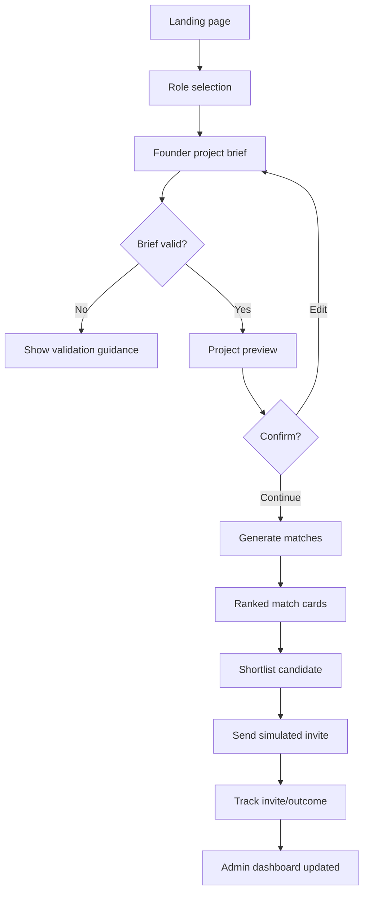
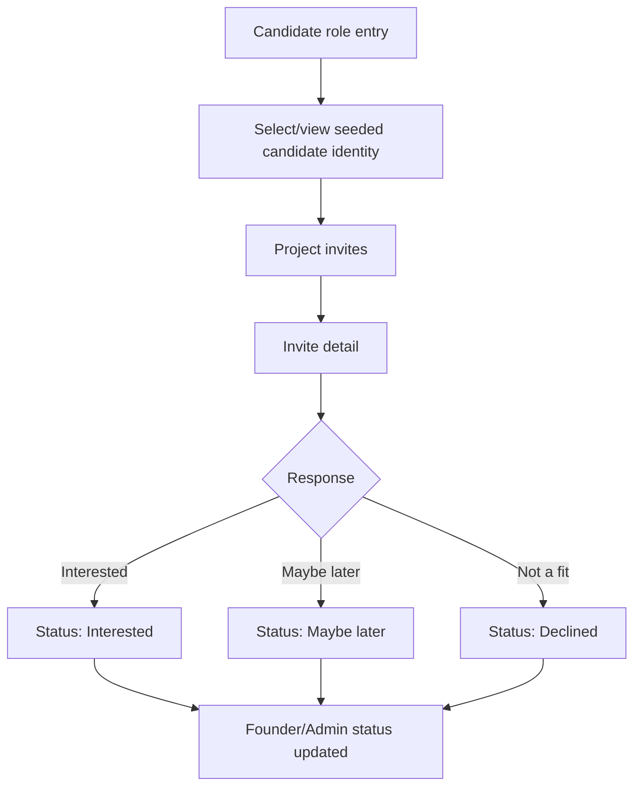
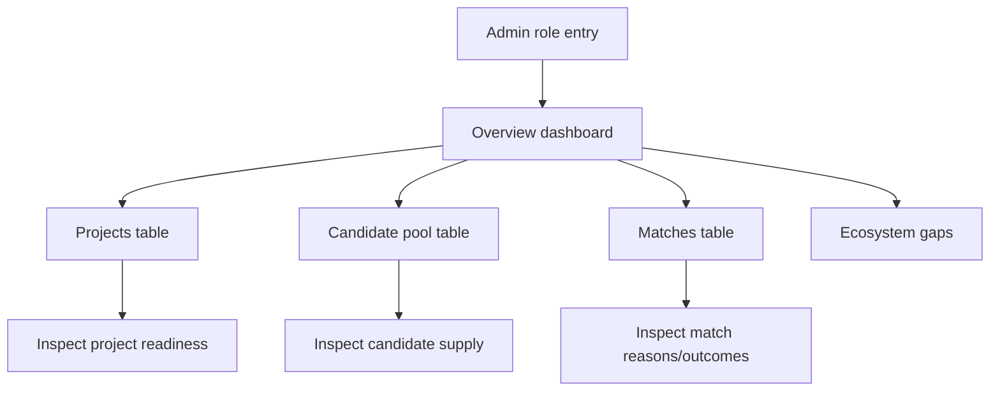
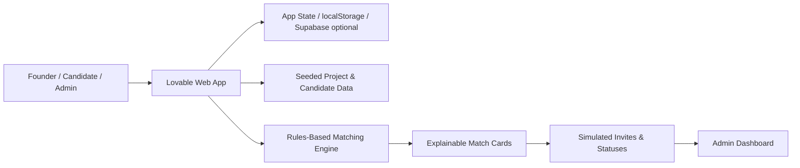
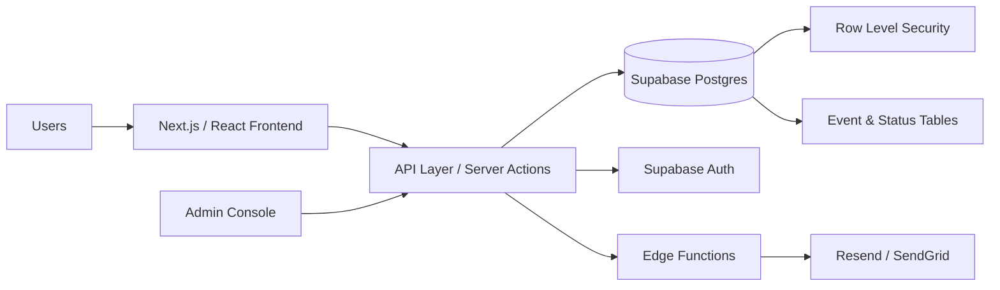
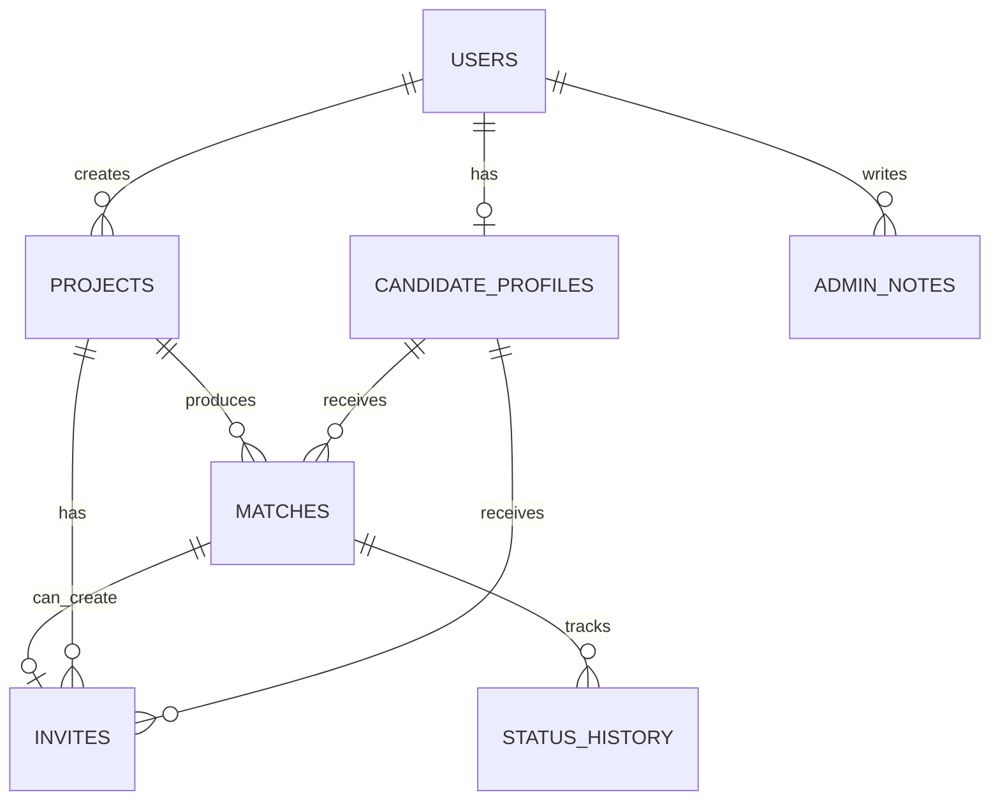

# TeamZero - Product Requirements Document

**Version:** PRD v2.0  
**Date:** April 27, 2026  
**Product type:** Pilot-style MVP for founder-team matching  
**Build posture:** Lovable-first classroom MVP with a clean migration path to a real ESSEC pilot  
**Primary audience:** Product builder, Lovable implementation owner, technical reviewer, ESSEC entrepreneurship stakeholder

---

## VISION & CONTEXT

### 1.1 Product vision

TeamZero helps ESSEC phase-zero founders find serious, complementary first teammates before their startup idea loses momentum.

The product is not intended to become a generic networking app, open student directory, job board, or LinkedIn clone. The core product promise is narrower and sharper:

> A founder with a serious early-stage idea should be able to create a structured project brief, receive explainable teammate recommendations, invite relevant candidates, and create at least one serious teammate conversation.

For the first build, TeamZero should simulate the end-to-end experience of a real ESSEC pilot without requiring production-grade authentication, real student onboarding, legal agreements, email infrastructure, or full privacy operations.

### 1.2 Problem addressed

ESSEC students and recent alumni often have early-stage venture ideas but lack one or more complementary profiles needed to move from idea to execution. Existing workarounds are inefficient:

| Current workaround | Core weakness |
|---|---|
| Asking friends/classmates | Limited to existing social circle; weak complementarity |
| WhatsApp or Slack group posts | Low structure, low signal, unclear seriousness |
| LinkedIn outreach | Cold, slow, not optimized for co-founder/team discovery |
| ESSEC events/clubs | Useful but episodic and chance-based |
| Incubator/program manager intros | High quality but manual and hard to scale |
| Hackathons | Often short-term and event-driven |
| Freelancers/no-code/AI tools | Help execution but do not solve ownership, accountability, or judgment |
| Building alone | Slower learning, poor credibility, skill gaps, loss of momentum |

The real user pain is not “I cannot find people.” It is:

> “I cannot quickly find people who are complementary, serious, available, interested in my problem space, and open to the kind of collaboration I need.”

### 1.3 Target users / personas

#### Persona A - Phase-Zero Founder

**Profile:** ESSEC student or recent alumni with a startup, course, incubator, side-project, or competition idea.  
**Motivation:** Find 1-3 serious people worth speaking to.  
**Needs:** Complementary skills, credibility, availability, commitment alignment, trust.  
**Anxieties:** Idea theft, wasting time with unserious people, not knowing how to explain the role needed.  
**Success moment:** “I found 3 relevant profiles and scheduled a serious intro call.”

#### Persona B - Candidate / Potential Teammate

**Profile:** ESSEC student or alumni who wants to join or advise an early-stage project without necessarily starting one.  
**Motivation:** Discover serious opportunities where skills and interests matter.  
**Needs:** Clear project context, role expectations, commitment level, why they were matched, founder seriousness.  
**Anxieties:** Being spammed, joining vague projects, unclear workload, weak founder credibility.  
**Success moment:** “I found a project aligned with my skills and I know exactly why I was invited.”

#### Persona C - Admin / Operator

**Profile:** TeamZero operator, ESSEC Ventures stakeholder, entrepreneurship club lead, program manager, or demo evaluator.  
**Motivation:** Monitor match quality, curate supply/demand, and understand team formation gaps.  
**Needs:** Project pipeline, candidate pool, match status, ecosystem gaps, quality control, exportable insights.  
**Success moment:** “I can see which projects are blocked by missing roles and which profiles are scarce.”

### 1.4 Unique value proposition

**For founders:**  
Find serious first teammates faster through structured, explainable matching inside a trusted ESSEC context.

**For candidates:**  
Get discovered for relevant startup opportunities based on skills, interests, proof of work, availability, and collaboration intent.

**For ESSEC / ecosystem operators:**  
Improve team formation, founder readiness, and visibility into missing skills across the entrepreneurship ecosystem.

**Differentiation:**  
TeamZero is not optimized for broad networking. It is optimized for one high-value outcome: creating serious founder-teammate conversations.

---

## OBJECTIVES & METRICS

### 2.1 Business objectives

#### MVP objectives

1. Validate that founders want a structured way to find early teammates.
2. Validate that candidate profiles can be converted into useful recommendations.
3. Validate that explainable matching increases founder trust.
4. Validate that candidates understand why they were invited and respond meaningfully.
5. Validate that an admin dashboard can reveal ecosystem gaps.

#### Strategic objectives

1. Prove TeamZero can become a founder-team matching layer for entrepreneurship programs.
2. Demonstrate a future B2B/B2B2C model where ecosystem owners pay for cohort-based matching and reporting.
3. Build a repeatable playbook for university incubators, startup competitions, entrepreneurship chairs, and alumni networks.

### 2.2 Success KPIs with targets

#### North Star Metric

**Serious founder-teammate conversations created through TeamZero.**

A “serious conversation” means a founder and candidate agree to a 20+ minute discussion about a specific project and role.

#### MVP funnel KPIs

| Funnel stage | KPI | MVP target | Measurement method |
|---|---:|---:|---|
| Founder intake | Founder brief completion rate | 60-70% | Completed briefs / started briefs |
| Match relevance | Founders rating at least 3 matches as relevant | 70% | Post-match survey or thumbs-up |
| Founder action | Founders sending at least 1 invite | 50% | Invite event tracking |
| Candidate response | Positive response rate | 30-50% | Interested + Maybe later / invites sent |
| Core outcome | Founders scheduling at least 1 serious call | 30-40% | Self-reported status update |
| Time-to-value | Median time from project brief to first invite | < 5 minutes in demo | Event timestamps |
| Candidate trust | Candidates who understand why they were matched | 80% | Candidate survey |
| Admin value | Admin can identify top 3 supply/demand gaps | Yes/no after test | Admin evaluation |

#### Quality metrics

| Metric | Target |
|---|---:|
| Invalid match rate | < 20% of displayed matches |
| Hard-filter violation rate | 0% in demo dataset |
| Candidate cards with proof-of-work signal | > 70% |
| Project briefs passing completeness threshold | > 80% |
| Admin-reviewed match override rate | Track, do not optimize yet |

### 2.3 MVP success criteria

The MVP is successful if a demo or test cohort can show this loop:

1. Founder creates a structured project brief.
2. System generates 5-10 ranked candidate matches.
3. Founder understands why candidates were recommended.
4. Founder shortlists and sends at least one invite.
5. Candidate sees a project invite and understands the reason for the match.
6. Candidate selects Interested, Maybe later, or Not a fit.
7. Admin can view project, candidate, match, invite, and outcome status.
8. At least one serious conversation is recorded or simulated credibly.

The MVP is not successful if users only browse cards without taking action, if matches feel generic, or if the product feels like a static directory rather than a guided matching workflow.

---

## SCOPE & PRIORITIZATION

### 3.1 MVP - Must-have

The MVP should be buildable rapidly in Lovable while preserving the core product logic.

| Feature | Priority | Description | Acceptance criteria |
|---|---:|---|---|
| Landing page | P0 | Communicates promise and role entry | User understands product in < 10 seconds |
| Mock role selection | P0 | Founder / Candidate / Admin entry | No real auth required; role state persists during session |
| Founder project brief | P0 | Structured intake form | Required fields validated; preview generated |
| Project preview | P0 | Shows founder how project appears | Founder can edit or continue to matches |
| Seeded candidate database | P0 | 12-20 realistic profiles | Covers key roles: AI/data, no-code, UX/UI, product, GTM, sales, ops, domain expert, alumni advisor |
| Matching engine | P0 | Rules-based explainable matching | Produces score, label, reason bullets, hard-filter exclusions |
| Match results | P0 | Ranked candidate cards | Shows 5-10 matches with relevance explanation |
| Shortlist | P0 | Founder saves candidates | Candidate state changes to shortlisted |
| Simulated invite | P0 | Founder sends invite | Invite status changes; generated intro message shown |
| Candidate invite view | P0 | Candidate sees matched projects | Candidate can respond Interested / Maybe later / Not a fit |
| Outcome tracking | P0 | Founder/Admin updates status | Status changes logged in local state or DB |
| Admin dashboard | P0 | Overview and ecosystem insights | Shows projects, candidates, matches, statuses, role gaps |
| Empty/loading/error states | P0 | Handles no data and invalid actions | Every major screen has a usable state |
| Demo reset | P1 | Reset mock state | Demo can restart without rebuilding app |

### 3.2 Phase 2 - Should-have

| Feature | Reason to add after MVP |
|---|---|
| Real authentication with ESSEC email verification | Required for real pilot trust |
| Candidate profile creation | Needed once seeded profiles become insufficient |
| Real invite notifications | Needed for real candidate response loop |
| Mutual contact reveal | Protects privacy and trust |
| Admin approval queue | Prevents poor-quality projects or spam |
| Feedback on match quality | Improves scoring and identifies false positives |
| Candidate availability calendar field | Improves call scheduling readiness |
| Export dashboard | Useful for ESSEC stakeholders |
| Analytics event tracking | Needed to measure funnel quality |
| Audit trail/status history | Required for admin reliability |

### 3.3 Future - Nice-to-have

| Feature | Reason to defer |
|---|---|
| AI-assisted matching | Rules-based matching is enough to validate early behavior |
| AI-generated project brief improvement | Useful, but can hide weak founder clarity in MVP |
| In-app messaging | Expensive, trust-sensitive, and not needed to validate matching |
| Calendar scheduling integration | Useful once serious call volume is proven |
| LinkedIn import | External dependency; creates privacy and data quality complexity |
| Reputation/endorsement system | Requires repeated usage and trust graph |
| Equity/legal templates | Sensitive and outside the core matching loop |
| Multi-school expansion | Premature before ESSEC loop is validated |
| Mobile app | Web responsive is enough initially |
| Payment/subscription | Monetization should follow validation and institutional interest |

### 3.4 Explicit out-of-scope

For the MVP, the following are explicitly out of scope:

1. Real ESSEC SSO or OAuth.
2. Real email sending.
3. Payment, subscription, or billing.
4. In-app chat.
5. Public candidate directory.
6. Open social feed.
7. Legal/equity advice.
8. Real confidential startup data.
9. Real production PII processing.
10. Full mobile-native app.
11. AI model training.
12. Production-grade admin permissions.
13. Direct integration with ESSEC systems.

---

## FUNCTIONAL SPECIFICATIONS

### 4.1 Detailed user stories

#### Founder stories

| ID | User story | Priority | Acceptance criteria |
|---|---|---:|---|
| F-01 | As a founder, I want to choose “Continue as Founder” so that I can enter the correct workflow quickly. | P0 | Role state is set; founder dashboard/form opens |
| F-02 | As a founder, I want to create a structured project brief so that the system can understand what teammate I need. | P0 | Required fields are completed; validation prevents empty core fields |
| F-03 | As a founder, I want examples and helper text in the brief form so that I can write a clear project description. | P0 | Each complex field has short guidance |
| F-04 | As a founder, I want to preview my project card before matching so that I know what candidates would see. | P0 | Preview shows title, pitch, industry, roles, commitment, milestone |
| F-05 | As a founder, I want to receive ranked candidate matches so that I can focus on the most relevant profiles first. | P0 | At least 5 matches displayed when candidate pool allows |
| F-06 | As a founder, I want to understand why each person was matched so that I can trust the recommendation. | P0 | Each card shows 2-4 match reasons and any warnings |
| F-07 | As a founder, I want weak matches filtered out so that I do not waste time. | P0 | Hard filters exclude role/commitment mismatches |
| F-08 | As a founder, I want to shortlist candidates so that I can compare before inviting. | P0 | Shortlisted candidates appear in shortlist view |
| F-09 | As a founder, I want a suggested invite message so that I can send a clear first message quickly. | P0 | Message includes project, reason for match, role, call CTA |
| F-10 | As a founder, I want to track each invite status so that I know who is interested. | P0 | Status updates appear in shortlist/admin dashboard |
| F-11 | As a founder, I want to mark outcomes like “call scheduled” or “not a fit” so that progress is visible. | P1 | Status can be changed and timestamped |

#### Candidate stories

| ID | User story | Priority | Acceptance criteria |
|---|---|---:|---|
| C-01 | As a candidate, I want to enter as a candidate so that I can view project invites relevant to me. | P0 | Candidate view opens with seeded identity selector or default profile |
| C-02 | As a candidate, I want to see why I was matched so that I can judge whether the invite is relevant. | P0 | Invite shows role requested, skills matched, interest overlap, commitment |
| C-03 | As a candidate, I want to see founder/project seriousness signals so that I avoid vague projects. | P0 | Project card shows stage, progress, milestone, founder brings |
| C-04 | As a candidate, I want to respond Interested / Maybe later / Not a fit so that I can control engagement. | P0 | Response updates invite status |
| C-05 | As a candidate, I want to add an optional note so that I can explain my interest or constraints. | P1 | Optional note saved with response |

#### Admin stories

| ID | User story | Priority | Acceptance criteria |
|---|---|---:|---|
| A-01 | As an admin, I want to view all projects so that I can monitor demand. | P0 | Table lists project title, founder, role needs, status |
| A-02 | As an admin, I want to view the candidate pool so that I can understand supply. | P0 | Table lists role fit, skills, availability, open-to, trust signal |
| A-03 | As an admin, I want to inspect matches so that I can evaluate recommendation quality. | P0 | Shows project, candidate, score, reasons, status |
| A-04 | As an admin, I want ecosystem gap insights so that I can identify scarce roles. | P0 | Shows demand vs supply by role and skill |
| A-05 | As an admin, I want outcome metrics so that I can assess whether TeamZero creates conversations. | P0 | Dashboard shows invites, interest, calls, trial sprints, joined projects |
| A-06 | As an admin, I want to flag low-completeness projects so that poor briefs do not produce misleading matches. | P1 | Completeness score or warning visible |

### 4.2 Main user flows

#### Founder core flow



#### Candidate response flow



#### Admin flow



### 4.3 Business rules

#### Project brief rules

1. Project title, one-line pitch, problem, industry, stage, roles needed, skills needed, expected commitment, and collaboration type are required.
2. One-line pitch should be limited to 160 characters.
3. Project problem statement should be 50-600 characters.
4. Roles needed must use controlled values to support matching.
5. Skills needed must use controlled tags plus optional free-text.
6. Founder must state what they bring to reduce one-sided “find me a builder” behavior.
7. Founder must specify “not a good fit if...” to reduce poor invites.
8. Project can be marked as demo/mock, active pilot, archived, or rejected.

#### Candidate profile rules

1. Candidate must have at least one role fit.
2. Candidate must have at least three skill tags.
3. Candidate must state availability band.
4. Candidate must state collaboration intent: co-founder, core teammate, contributor, advisor.
5. Candidate should have at least one proof-of-work signal.
6. Candidate visibility status must be mock, active, hidden, or archived.

#### Matching rules

1. Hard filters run before scoring.
2. A candidate below 55% should not appear by default.
3. A candidate cannot be labeled Strong Match if any hard filter fails.
4. Role fit and commitment fit should dominate the score.
5. Match explanations must map to actual scoring criteria.
6. Match cards should show warnings when the score is high but there is a notable risk, such as limited availability.
7. Candidate ranking should be deterministic for demo reliability unless randomization is explicitly enabled.

#### Invite rules

1. Founder can invite only shortlisted candidates.
2. Sending an invite creates an invite record and changes match status to invited.
3. Candidate response changes invite status and match status.
4. Candidate cannot respond twice without changing the previous response.
5. Founder can mark manual outcome: call scheduled, trial sprint started, joined, not a fit.

### 4.4 Use cases & scenarios

#### Use case 1 - AI SaaS founder needs technical builder

A founder is building AI SaaS for small retailers. They have business validation but need an AI/data builder. TeamZero ranks candidates with AI/data role fit, LLM proof of work, 5-10h/week availability, and B2B SaaS interest. Founder shortlists two candidates and sends one invite.

#### Use case 2 - ClimateTech founder needs GTM teammate

A founder has a ClimateTech/food-waste idea and a no-code prototype, but lacks B2B sales and partnerships capability. TeamZero ranks candidates with GTM/growth/sales roles and climate/food interest. Technical builders may score lower despite strong skills because the missing role is GTM.

#### Use case 3 - Candidate receives invite but declines

A candidate is matched because they have UX/UI skills, but expected commitment is 10+ hours/week and they are only available 1-3 hours/week. The system should ideally avoid ranking them strongly. If shown, the card must flag availability mismatch.

#### Use case 4 - Admin sees ecosystem gap

Five projects need AI/data builders, but only two candidates match the role and availability constraints. Admin dashboard shows a shortage of AI/data profiles and suggests candidate recruitment focus.

### 4.5 Edge cases & error handling

| Edge case | Required behavior |
|---|---|
| Founder leaves required form field empty | Show inline validation and block submission |
| Founder selects too many roles needed | Warn that matching will be less precise; recommend top 1-2 roles |
| No candidates pass hard filters | Show “No strong matches yet” and explain which constraint is blocking results |
| Fewer than 5 candidates pass filters | Show all available matches and suggest broadening criteria |
| Candidate has high skill fit but poor commitment fit | Show warning; do not label Strong Match |
| Founder repeatedly invites same candidate | Disable duplicate invite; show existing status |
| Candidate declines | Update status; offer reason capture if available |
| Candidate says Maybe later | Keep candidate in pipeline but not active next step |
| Admin opens dashboard with no projects | Show empty state with sample action |
| Mock app refresh loses state | Use localStorage or lightweight database to persist demo state |
| Seed data missing fields | Show graceful fallback and admin data quality warning |
| Mobile viewport | Forms and cards stack cleanly; no horizontal overflow |
| Long project text | Truncate on cards; full text in detail view |
| Ambiguous role tags | Use controlled role taxonomy and helper text |

---

## TECHNICAL SPECIFICATIONS

### 5.1 General architecture

TeamZero should be designed in two modes:

#### Mode 1 - Lovable classroom MVP

The Lovable MVP should be a responsive React-style web app with mock role selection, local or lightweight persistence, seeded data, and deterministic rules-based matching.



#### Mode 2 - Real ESSEC pilot

The real pilot should use React/Next.js plus Supabase or equivalent backend-as-a-service.



### 5.2 Tech stack justified

#### MVP stack

| Layer | Recommended choice | Why |
|---|---|---|
| UI/app builder | Lovable | Fastest path to clickable MVP and demo |
| Frontend | React generated by Lovable | Flexible, common, easy migration |
| Styling | Tailwind-style utility classes | Fast, consistent, component-friendly |
| State | localStorage or simple Supabase table | Enough for demo persistence |
| Data | Seeded JSON data | Deterministic and easy to tune |
| Matching | Client-side TypeScript function | Transparent and easy to debug |
| Admin dashboard | Same Lovable app | Avoids separate admin build |

#### Real pilot stack

| Layer | Recommended choice | Why |
|---|---|---|
| Frontend | Next.js / React | Production-grade routing, deployment, auth integration |
| Backend | Supabase | Auth, Postgres, RLS, storage, quick pilot velocity |
| Database | Postgres | Relational fit for users, projects, matches, invites, statuses |
| Email | Resend or SendGrid | Transactional invite notifications |
| Hosting | Vercel + Supabase | Low operational overhead |
| Analytics | PostHog or Supabase events | Funnel tracking and product analytics |
| Monitoring | Sentry + Supabase logs | Error visibility |

#### Alternatives considered

| Alternative | Trade-off |
|---|---|
| Firebase | Faster real-time features, weaker relational fit and SQL analytics than Postgres |
| Airtable backend | Fast but fragile for auth, RBAC, and real pilot privacy |
| Custom Node/Express backend | More control but slower and unnecessary for pilot |
| Full AI matching from day one | Impressive but less explainable, harder to validate, and more expensive |

### 5.3 Data model

#### Entity overview



#### Users

| Field | Type | Constraints |
|---|---|---|
| id | uuid/string | Primary key |
| name | text | Required |
| email | text | Required in real pilot, unique |
| role | enum | founder, candidate, admin |
| essec_status | enum | student, alumni, staff, mock |
| program_year | text | Optional |
| created_at | timestamp | Required |
| updated_at | timestamp | Required |

#### Candidate profiles

| Field | Type | Constraints |
|---|---|---|
| id | uuid/string | Primary key |
| user_id | uuid/string | Nullable in mock mode, FK in real pilot |
| name | text | Required |
| essec_status | enum | student, alumni, mock |
| program_year | text | Optional |
| role_fit | text[] | Required, min 1 |
| top_skills | text[] | Required, min 3 |
| startup_interests | text[] | Optional but recommended |
| proof_of_work | text | Recommended |
| linkedin_or_portfolio | text | Optional URL |
| availability_band | enum | 1-3h, 3-5h, 5-10h, 10h+ |
| commitment_level | enum | exploratory, contributor, core teammate, co-founder, advisor |
| open_to | text[] | co-founder, core teammate, contributor, advisor |
| working_style_tags | text[] | Optional |
| motivation_statement | text | Optional |
| visibility_status | enum | mock, active, hidden, archived |
| trust_signal_level | enum | none, weak, moderate, strong |

#### Projects

| Field | Type | Constraints |
|---|---|---|
| id | uuid/string | Primary key |
| founder_id | uuid/string | Required in real pilot |
| title | text | Required |
| one_line_pitch | text | Required, max 160 chars |
| problem | text | Required |
| target_users | text | Required |
| industry | text | Required controlled tag |
| stage | enum | idea, problem validated, prototype, MVP, launched |
| progress_so_far | text | Optional |
| roles_needed | text[] | Required, min 1 |
| skills_needed | text[] | Required |
| expected_commitment | enum | 1-3h, 3-5h, 5-10h, 10h+ |
| timeline | text | Required |
| founder_brings | text | Required |
| ideal_teammate | text | Required |
| not_good_fit_if | text | Required |
| collaboration_type | text[] | co-founder, core teammate, contributor, advisor |
| privacy_level | enum | public summary, private details |
| status | enum | draft, active, matched, archived, rejected |
| completeness_score | number | 0-100 |

#### Matches

| Field | Type | Constraints |
|---|---|---|
| id | uuid/string | Primary key |
| project_id | uuid/string | Required |
| candidate_id | uuid/string | Required |
| match_score | number | 0-100 |
| match_label | enum | strong, good, exploratory, hidden |
| role_fit_score | number | 0-100 |
| commitment_score | number | 0-100 |
| skill_score | number | 0-100 |
| industry_score | number | 0-100 |
| working_style_score | number | 0-100 |
| hard_filter_passed | boolean | Required |
| match_reasons | text[] | Required |
| match_warnings | text[] | Optional |
| admin_approved | boolean | Optional |
| status | enum | recommended, shortlisted, invited, interested, maybe_later, declined, call_scheduled, trial_sprint, joined, rejected |
| created_at | timestamp | Required |

#### Invites

| Field | Type | Constraints |
|---|---|---|
| id | uuid/string | Primary key |
| project_id | uuid/string | Required |
| founder_id | uuid/string | Required |
| candidate_id | uuid/string | Required |
| match_id | uuid/string | Required |
| message | text | Required |
| status | enum | draft, sent, interested, maybe_later, declined, expired |
| candidate_note | text | Optional |
| created_at | timestamp | Required |
| responded_at | timestamp | Optional |

#### Status history

| Field | Type | Constraints |
|---|---|---|
| id | uuid/string | Primary key |
| entity_type | enum | project, match, invite |
| entity_id | uuid/string | Required |
| previous_status | text | Optional |
| new_status | text | Required |
| changed_by | uuid/string | Nullable in mock mode |
| changed_at | timestamp | Required |

### 5.4 APIs & integrations

For the Lovable MVP, API calls may be simulated or handled entirely in client state. For real pilot readiness, design around these API concepts:

| Method | Endpoint | Purpose |
|---|---|---|
| POST | /api/projects | Create project brief |
| GET | /api/projects/:id | Get project detail |
| PATCH | /api/projects/:id | Update project |
| POST | /api/projects/:id/matches/generate | Generate matches |
| GET | /api/projects/:id/matches | List project matches |
| PATCH | /api/matches/:id/status | Update match status |
| POST | /api/invites | Send invite |
| GET | /api/candidates/:id/invites | Candidate invite list |
| PATCH | /api/invites/:id/respond | Candidate response |
| GET | /api/admin/dashboard | Admin KPIs and gaps |

#### Integration policy

MVP should avoid external dependencies except optional Supabase. Real pilot can add:

1. ESSEC email verification or SSO.
2. Transactional email provider.
3. Product analytics.
4. Error monitoring.
5. Optional LinkedIn/portfolio URL validation.

### 5.5 Security & compliance

#### MVP security posture

The classroom MVP must not process real confidential startup data or real personal information without consent. Use mock profiles and simulated data. If testing with real users, use an explicit consent notice and avoid sensitive personal data.

#### Real pilot controls

| Area | Requirement |
|---|---|
| Authentication | ESSEC email verification or approved login provider |
| Authorization | Role-based access control and Supabase RLS |
| Data minimization | Collect only fields needed for matching |
| Privacy | Contact details visible only after mutual interest |
| Project confidentiality | Public summary and private details separated |
| Auditability | Status changes and admin actions logged |
| Encryption | TLS in transit; provider-managed encryption at rest |
| GDPR | Consent, privacy notice, right to access/delete, retention limits |
| OWASP | Input validation, access control, rate limiting, secure headers |

### 5.6 Performance & scalability

#### MVP performance targets

| Area | Target |
|---|---:|
| Landing page load | < 2 seconds on standard broadband |
| Match generation for 20 mock candidates | < 500ms |
| Match generation for 500 candidates in pilot | < 2 seconds |
| Dashboard render | < 2 seconds |
| Form autosave/local persistence | < 250ms perceived delay |

#### Scalability assumptions

The real ESSEC pilot is likely small: 10-100 founders and 50-500 candidates. A simple relational architecture is enough. Complexity should stay in data quality, matching rules, trust, and workflow; not in distributed infrastructure.

#### Optimization approach

1. Keep matching deterministic and transparent.
2. Precompute matches after project submission for pilot scale.
3. Add indexes on project_id, candidate_id, status, role tags, and created_at.
4. Cache dashboard aggregates if admin data grows.
5. Avoid premature microservices.

---

## UX/UI SPECIFICATIONS

### 6.1 Design principles

1. **Trust before volume:** Users should feel the platform is curated, serious, and not spammy.
2. **Explain every recommendation:** Never show a match score without reasons.
3. **Action over browsing:** Every screen should move the user closer to a serious conversation.
4. **Founder clarity:** The brief form should help founders articulate their need.
5. **Candidate control:** Candidates should understand why they were invited and control response.
6. **Admin visibility:** Admin should immediately see demand, supply, and bottlenecks.
7. **No generic social feed:** Avoid UI patterns that feel like browsing people casually.

### 6.2 Key wireframes / mockups

#### Landing page

```text
+--------------------------------------------------+
| TeamZero                                         |
| Find your first serious startup teammate         |
| inside the ESSEC ecosystem.                      |
|                                                  |
| [Post your project]  [Explore as candidate]      |
|                                                  |
| Example match card:                              |
| 91% Strong Match                                 |
| AI/Data Builder - 5-10h/week - B2B SaaS interest |
| Strong because: role fit + proof of work + intent|
+--------------------------------------------------+
```

#### Founder project brief form

```text
Step 1: Project basics
- Project title
- One-line pitch
- Problem
- Target users
- Industry
- Stage

Step 2: Teammate need
- Roles needed
- Skills needed
- Expected commitment
- Collaboration type
- Ideal teammate
- Not a good fit if...

Step 3: Seriousness signals
- What has already been done
- What founder brings
- Timeline / next milestone

[Preview project] [Save draft]
```

#### Match card

```text
+--------------------------------------------------+
| 91% Strong Match                [Shortlist]      |
| Ananya R. - AI/Data Builder                      |
| Skills: Python, LLM prototyping, Streamlit       |
| Availability: 5-10h/week                         |
| Open to: Core teammate / co-founder discussion   |
| Proof: Built LLM prototype for retail analytics  |
|                                                  |
| Strong match because:                            |
| - Fills your AI/Data builder need                |
| - Has proof of work in LLM prototyping           |
| - Available at your expected commitment level    |
| - Interested in B2B SaaS                         |
|                                                  |
| Warning: No prior co-founder experience          |
| [View detail] [Send invite]                      |
+--------------------------------------------------+
```

#### Admin dashboard

```text
+--------------------------------------------------+
| Admin Dashboard                                  |
| Projects: 12 | Candidates: 54 | Invites: 26      |
| Interested: 9 | Calls scheduled: 4 | Joined: 1    |
|                                                  |
| Ecosystem gap:                                  |
| AI/Data demand: 7 projects | Supply: 3 profiles  |
| GTM demand: 4 projects | Supply: 9 profiles      |
|                                                  |
| [Projects] [Candidate pool] [Matches] [Outcomes] |
+--------------------------------------------------+
```

### 6.3 Design system & components

#### Core components

| Component | Usage |
|---|---|
| RoleSelectionCard | Founder/Candidate/Admin entry |
| ProjectBriefForm | Structured founder intake |
| ProjectPreviewCard | Founder confirmation and candidate invite view |
| CandidateMatchCard | Match results |
| MatchScoreBadge | Strong/Good/Exploratory label |
| ReasonChips | Explainable matching reasons |
| WarningBanner | Hard/soft mismatch alerts |
| ShortlistDrawer | Saved candidates |
| InviteComposer | Suggested intro message |
| CandidateInviteCard | Candidate response screen |
| AdminMetricCard | Dashboard KPIs |
| GapInsightCard | Role demand/supply gaps |
| DataTable | Projects/candidates/matches |
| EmptyState | No matches, no invites, no projects |
| DemoResetButton | Reset seeded data |

#### Visual style

- Clean, modern, startup-oriented.
- Avoid flashy social network aesthetics.
- Use calm neutral base colors with one strong accent.
- Rounded cards, clear hierarchy, strong whitespace.
- Match score should be visible but not over-dominant; explanation matters more than the number.

### 6.4 Responsive & accessibility

#### Responsive requirements

| Breakpoint | Behavior |
|---|---|
| Mobile | Single-column cards, sticky CTA, step-by-step form |
| Tablet | Two-column layouts where useful |
| Desktop | Dashboard tables and side-by-side cards |

#### Accessibility requirements

1. Use semantic headings and landmarks.
2. Ensure keyboard navigation for forms and buttons.
3. Maintain color contrast at WCAG AA level.
4. Do not rely on color alone for match status.
5. Add labels and helper text for all form inputs.
6. Provide clear error messages.
7. Ensure focus states are visible.
8. Avoid tiny badges as the only source of critical information.

#### Internationalization readiness

MVP can be English-only. Future pilot should keep copy centralized so French/English support can be added if needed.

### 6.5 Micro-interactions

| Interaction | Expected behavior |
|---|---|
| Form progress | Show step indicator and completion percentage |
| Field validation | Inline errors, not modal errors |
| Match generation | Show “Generating explainable matches...” loading state |
| Shortlist click | Button changes to “Shortlisted” with subtle confirmation |
| Invite sent | Status badge changes to “Invited” and appears in candidate view |
| Candidate response | Confirmation state and optional note saved |
| Admin filters | Instant filter by role, status, industry, score |
| Empty match state | Explain what constraint blocked matches and what to change |

---

## INFRASTRUCTURE & OPS

### 7.1 Hosting & deployment

#### MVP

| Area | Recommendation |
|---|---|
| Hosting | Lovable publish/export or Vercel if exported |
| Data | Seeded JSON, localStorage, or Supabase dev project |
| Environment | Single demo environment |
| Access | Public demo link with mock data only |

#### Real pilot

| Area | Recommendation |
|---|---|
| Frontend hosting | Vercel |
| Backend/database | Supabase project |
| Transactional email | Resend or SendGrid |
| Domain | teamzero.app or school-specific subdomain |
| Environments | dev, staging, production |
| Secrets | Managed via Vercel/Supabase env vars |

### 7.2 CI/CD pipeline

#### MVP minimum

1. Lovable version history or GitHub export.
2. Manual test checklist before demo.
3. Seed data reset before each demo.

#### Real pilot pipeline

1. GitHub repository.
2. Pull request review.
3. TypeScript linting.
4. Unit tests for matching logic.
5. Supabase migration review.
6. Preview deployment per PR.
7. Production deployment after approval.

### 7.3 Monitoring & alerting

#### MVP

- Console errors should be fixed before demo.
- Manual test script should cover the main flow.

#### Real pilot

| Monitoring area | Tool / method |
|---|---|
| Frontend errors | Sentry |
| API failures | Sentry + logs |
| Database health | Supabase dashboard |
| Funnel events | PostHog or event table |
| Email delivery | Resend/SendGrid dashboard |
| Uptime | Vercel/Supabase status + simple uptime monitor |

### 7.4 Backup & disaster recovery

#### MVP

- Keep seed data in version-controlled JSON.
- Provide demo reset function.
- No real user data should require backup.

#### Real pilot

1. Enable daily database backups.
2. Export key tables before major schema changes.
3. Use migration files for all DB changes.
4. Define deletion and retention policy.
5. Keep audit logs for admin actions and status changes.

### 7.5 Estimated costs

#### Classroom MVP

| Item | Expected cost |
|---|---:|
| Lovable build | Depends on plan; usually low/no-code tool cost |
| Hosting | Free/low tier likely enough |
| Supabase dev project | Free/low tier likely enough |
| Email | Not required |
| Monitoring | Not required |

#### Real pilot

| Item | Expected monthly range |
|---|---:|
| Vercel | Free-$20+ |
| Supabase | Free-$25+ initially |
| Email provider | Free-$20+ initially |
| Domain | ~$10-20/year |
| Analytics/monitoring | Free-$30+ initially |

Cost risk is low. Time and trust risk are higher than infrastructure cost.

---

## RISKS & MITIGATION

### 8.1 Technical risks

| Risk | Severity | Description | Mitigation |
|---|---|---|---|
| Lovable state fragility | Important | App state may reset or behave unpredictably in demo | Use Supabase or localStorage; add demo reset |
| Matching logic too opaque | Critical | Users may not trust rankings | Show sub-scores, reasons, and warnings |
| Hard filters not enforced | Critical | Bad matches undermine product credibility | Run hard filters before scoring; test examples |
| Poor seed data quality | Critical | Demo looks fake or generic | Create realistic candidate profiles with proof-of-work signals |
| Admin dashboard over-complexity | Important | Dashboard may slow build | Start with 4 widgets + 3 tables + gap cards |
| No validation of edge cases | Important | Demo breaks when forms are incomplete | Add validation and empty states |

### 8.2 Product / market risks

| Risk | Severity | Description | Mitigation |
|---|---|---|---|
| Weak candidate supply | Critical | Founders cannot get good matches | Supply-first beta; curate 50 profiles before real pilot |
| Low founder demand | Critical | Marketplace has no demand | Start with ESSEC Ventures applicants and startup clubs |
| Trust concerns | Critical | Founders fear idea theft; candidates fear exposure | Layered visibility and mutual contact reveal |
| Generic networking drift | Important | Product becomes directory/social feed | Keep brief -> match -> invite -> conversation loop |
| Candidate low response | Important | Invites do not convert to conversations | Limit invites, improve project seriousness, add clear why-match |
| Bad founder briefs | Important | Weak input causes weak matches | Guided form, completeness score, examples |

### 8.3 Operational risks

| Risk | Severity | Description | Mitigation |
|---|---|---|---|
| Manual curation burden | Important | Admin work may not scale | Accept manual concierge phase; automate after validation |
| Inaccurate self-reported skills | Important | Candidates overstate abilities | Require proof-of-work and admin review |
| Privacy/GDPR risk in real pilot | Critical | Mishandling student/alumni data creates liability | Data minimization, consent, RLS, deletion process |
| Unclear ownership | Important | No one maintains candidate pool | Define operator role and weekly curation cadence |
| Success not measured | Critical | Cannot decide whether to continue | Instrument funnel and define validation gates |

### 8.4 Mitigation plans

#### Validation-first plan

1. Build Lovable demo with mock data.
2. Run 5 internal demo tests.
3. Recruit 10 serious founders for interviews or concierge test.
4. Recruit/seed 50 candidate profiles.
5. Manually match 3-5 candidates per founder.
6. Track invite interest and serious calls.
7. Decide whether to invest in real Supabase pilot.

#### Data quality plan

1. Use controlled role taxonomy.
2. Require proof-of-work fields.
3. Add trust signal level.
4. Add completeness score for projects and candidate profiles.
5. Admin reviews low-confidence profiles before recommendation.

---

## ROADMAP & MILESTONES

### 9.1 Development phases

#### Phase 0 - Product hardening

- Finalize role taxonomy.
- Finalize candidate seed data schema.
- Finalize scoring rules and hard filters.
- Prepare demo founder projects.

#### Phase 1 - Lovable MVP

- Build landing page.
- Build role selector.
- Build founder project brief form.
- Build seeded candidate dataset.
- Implement matching function.
- Build match results and shortlist.
- Build candidate invite view.
- Build admin dashboard.
- Add empty/error/loading states.

#### Phase 2 - Concierge validation

- Test with 10 founders and 50 candidate profiles.
- Manually review matches.
- Capture match relevance and response data.
- Validate whether serious conversations happen.

#### Phase 3 - Real pilot architecture

- Add Supabase auth and database.
- Add RLS and roles.
- Add real candidate profile creation.
- Add email notifications.
- Add analytics and monitoring.

### 9.2 Estimated timeline

| Phase | Duration | Output |
|---|---:|---|
| Product hardening | 1-2 days | Final schema, seed data, rules |
| Lovable MVP build | 3-5 days | Demo app |
| Internal demo testing | 1 day | Bug fixes and flow validation |
| Concierge validation | 2-3 weeks | Founder/candidate feedback and outcome data |
| Real pilot build | 3-6 weeks | Production-ready pilot |

### 9.3 Critical dependencies

1. Quality of seed candidate profiles.
2. Clear role and skill taxonomy.
3. Reliable matching rules.
4. Founder project examples.
5. Admin dashboard simplified enough for rapid build.
6. Consent/privacy approach if real users are involved.
7. ESSEC stakeholder access if moving beyond classroom MVP.

### 9.4 Validation milestones

| Milestone | Go/no-go question |
|---|---|
| Demo complete | Can a user complete brief -> match -> invite -> response -> admin tracking? |
| Founder interview complete | Do at least 7/10 founders say the problem is real and painful? |
| Candidate supply test | Can 50 credible profiles be recruited/seeded? |
| Match relevance test | Do 70% of founders find at least 3 matches relevant? |
| Conversation test | Do 30-40% of founders schedule a serious call? |
| Pilot decision | Is there enough evidence to build real auth, database, and notifications? |

---

## APPENDICES

### 10.1 Glossary

| Term | Definition |
|---|---|
| Phase-zero founder | Founder with an early idea who needs a first teammate before significant execution |
| Serious conversation | A 20+ minute discussion about a specific project and teammate role |
| Candidate | Potential teammate, contributor, advisor, or co-founder |
| Hard filter | Non-negotiable rule that prevents a candidate from being strongly recommended |
| Proof of work | Evidence of execution such as project, portfolio, prototype, experience, or achievement |
| Collaboration type | Co-founder, core teammate, contributor, or advisor |
| Trust signal | Evidence that a profile is credible enough to recommend |
| Ecosystem gap | Mismatch between founder demand and candidate supply |

### 10.2 References & resources

Internal product resources to prepare:

1. Candidate seed profile template.
2. Founder project seed examples.
3. Role taxonomy.
4. Skill taxonomy.
5. Demo script.
6. User interview script.
7. Match feedback survey.
8. Consent and privacy notice for real pilot.

### 10.3 Architecture Decision Records

#### ADR-001 - Use rules-based matching for MVP

**Context:** The MVP must validate matching trust quickly.  
**Decision:** Use deterministic rules-based scoring with explicit reasons.  
**Alternatives:** AI matching, manual matching only.  
**Consequence:** Easier to explain and debug, but less flexible than AI.  
**Status:** Accepted.

#### ADR-002 - Use mock authentication in classroom MVP

**Context:** Real authentication slows classroom build and introduces privacy obligations.  
**Decision:** Use role selection for MVP.  
**Alternatives:** ESSEC SSO, Supabase auth from day one.  
**Consequence:** Faster demo, not production-secure.  
**Status:** Accepted for MVP only.

#### ADR-003 - Avoid in-app chat in MVP

**Context:** The product needs to validate matching, not messaging.  
**Decision:** Simulate invites and responses.  
**Alternatives:** Build chat, integrate email.  
**Consequence:** Faster build; serious call status must be manually tracked.  
**Status:** Accepted.

#### ADR-004 - Keep admin dashboard lightweight

**Context:** Admin dashboard can easily become overbuilt.  
**Decision:** Include only overview metrics, projects, candidates, matches, outcomes, and gaps.  
**Alternatives:** Full CRM-style dashboard.  
**Consequence:** Faster delivery and enough validation signal.  
**Status:** Accepted.

### 10.4 Open questions

1. Who is the exact first admin/operator: TeamZero founder, ESSEC Ventures, club lead, or demo admin?
2. What defines “recent alumni” for the initial scope: 1 year, 3 years, 5 years?
3. Should candidates be allowed to browse projects, or only respond to invites?
4. Should founders be limited in number of invites to prevent spam?
5. What is the minimum proof-of-work threshold for a profile to be recommended?
6. What privacy promise should be shown to founders before they submit an idea?
7. Should candidate profiles be opt-in only in a real pilot?
8. What is the exact role taxonomy for ESSEC context?
9. Does the product serve course projects, startup projects, or both?
10. What threshold determines whether the product moves from classroom MVP to real pilot?

