# Technical Architecture - TeamZero

**Version:** Architecture v1.0  
**Date:** April 27, 2026  
**Architecture posture:** Lovable MVP now, production pilot migration later  
**Primary goal:** Preserve rapid build speed while avoiding dead-end architecture decisions

---

## OVERVIEW

### High-level architecture: C4 Level 1

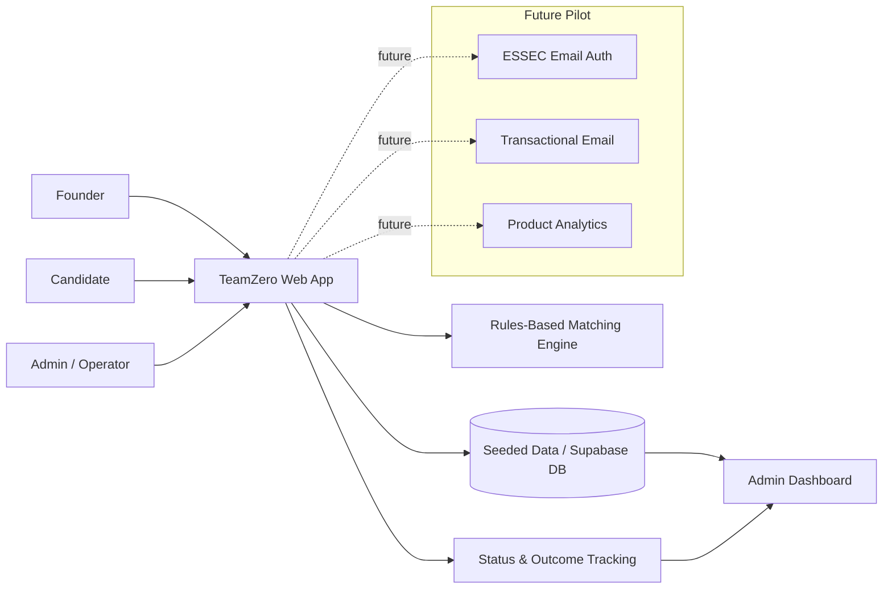

### High-level architecture: C4 Level 2

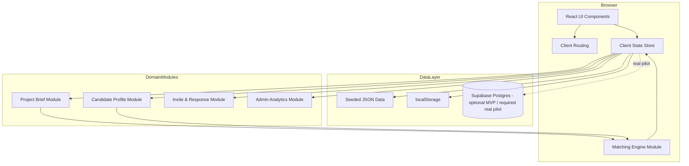

### Architectural principles

1. **Validation before scale:** Optimize for proving the matching loop, not building a complete marketplace.
2. **Explainability over complexity:** Every match score must be explainable through visible criteria.
3. **Deterministic demo behavior:** Seed data and matching output should be stable for demos.
4. **Mock now, migrate cleanly later:** Mock authentication and invites are acceptable only if the data model already maps to a real pilot.
5. **Single product loop:** Brief -> match -> shortlist -> invite -> candidate response -> outcome.
6. **No premature microservices:** A modular monolith or BaaS architecture is sufficient.
7. **Privacy-by-design for the real pilot:** Do not collect sensitive data until authentication, consent, RLS, and retention policy exist.
8. **Admin is a quality-control layer:** Admin dashboard is not only reporting; it is how the operator detects poor supply, demand gaps, and match failures.

### Constraints & drivers

| Constraint / driver | Architectural implication |
|---|---|
| Must be buildable quickly in Lovable | Avoid custom backend for MVP unless needed |
| Must simulate real ESSEC pilot | Use realistic entities: users, projects, candidates, matches, invites |
| Must not require production authentication | Use role selector in MVP; design real auth migration path |
| Matching must be trusted | Use explainable score components and reason generation |
| Candidate data is seeded initially | Use JSON seed files or seeded Supabase rows |
| Admin analytics needed | Track statuses and outcome events, not just static cards |
| Future real pilot handles PII | Require RLS, consent, data minimization, audit trail |
| Small initial scale | Simple Postgres schema and serverless deployment are enough |

---

## APPLICATION ARCHITECTURE

## 2.1 Frontend

### Frontend architecture pattern

For the Lovable MVP, use a component-based React structure with clear separation between:

1. UI components.
2. Page-level routes.
3. Domain logic.
4. Matching logic.
5. Seed data.
6. State persistence.

The matching engine should not be embedded inside UI components. It should be a pure function that accepts one project and a candidate list, then returns scored matches.

### Recommended folder structure

```text
src/
  app/
    App.tsx
    routes.tsx
  pages/
    LandingPage.tsx
    RoleSelectionPage.tsx
    FounderBriefPage.tsx
    ProjectPreviewPage.tsx
    MatchResultsPage.tsx
    FounderShortlistPage.tsx
    CandidateInvitesPage.tsx
    AdminDashboardPage.tsx
  components/
    layout/
      AppShell.tsx
      Header.tsx
      Sidebar.tsx
    project/
      ProjectBriefForm.tsx
      ProjectPreviewCard.tsx
      ProjectCompletenessMeter.tsx
    candidate/
      CandidateCard.tsx
      CandidateInviteCard.tsx
      CandidateProfileSummary.tsx
    matching/
      MatchScoreBadge.tsx
      MatchReasonList.tsx
      MatchWarningBanner.tsx
      MatchBreakdown.tsx
    admin/
      AdminMetricCard.tsx
      GapInsightCard.tsx
      ProjectsTable.tsx
      CandidatesTable.tsx
      MatchesTable.tsx
    shared/
      Button.tsx
      Badge.tsx
      EmptyState.tsx
      LoadingState.tsx
      ErrorState.tsx
      Modal.tsx
  domain/
    types.ts
    constants.ts
    roleTaxonomy.ts
    skillTaxonomy.ts
    projectValidation.ts
    candidateValidation.ts
  matching/
    scoreCandidate.ts
    hardFilters.ts
    generateReasons.ts
    rankCandidates.ts
    matching.test.ts
  data/
    seedCandidates.ts
    seedProjects.ts
    demoState.ts
  state/
    useAppStore.ts
    persistence.ts
  services/
    projectService.ts
    candidateService.ts
    matchService.ts
    inviteService.ts
    adminService.ts
  utils/
    dates.ts
    ids.ts
    scoring.ts
```

### State management

#### MVP recommendation

Use a lightweight store such as React state + context or Zustand-like state if Lovable supports it.

State slices:

```ts
type AppState = {
  currentRole: 'founder' | 'candidate' | 'admin' | null;
  currentUserId: string | null;
  projects: Project[];
  candidates: CandidateProfile[];
  matches: Match[];
  invites: Invite[];
  statusHistory: StatusHistory[];
};
```

Persist demo state with localStorage so that refresh does not destroy the demo flow:

```ts
const STORAGE_KEY = 'teamzero-demo-state-v1';

export function saveState(state: AppState) {
  localStorage.setItem(STORAGE_KEY, JSON.stringify(state));
}

export function loadState(): AppState | null {
  const raw = localStorage.getItem(STORAGE_KEY);
  if (!raw) return null;
  try {
    return JSON.parse(raw) as AppState;
  } catch {
    localStorage.removeItem(STORAGE_KEY);
    return null;
  }
}
```

#### Real pilot recommendation

Use Supabase as source of truth and client state only for UI caching. Use server-side checks for authorization and RLS policies for data enforcement.

### Routing & navigation

Recommended MVP routes:

| Route | Purpose | Access |
|---|---|---|
| / | Landing page | Public |
| /role | Mock role selection | Public demo |
| /founder/new-project | Project brief | Founder |
| /founder/project/:id/preview | Project preview | Founder |
| /founder/project/:id/matches | Match results | Founder |
| /founder/shortlist | Shortlist and invite tracking | Founder |
| /candidate/invites | Candidate project invites | Candidate |
| /admin | Admin dashboard | Admin |
| /admin/projects | Project table | Admin |
| /admin/candidates | Candidate pool table | Admin |
| /admin/matches | Match status table | Admin |

For MVP, route access is role-state based. For real pilot, route access must be auth and RBAC based.

### Performance optimizations

1. Keep candidate scoring O(n) for each project.
2. Memoize match generation for unchanged project/candidate inputs.
3. Avoid re-scoring candidates on every render.
4. Precompute dashboard aggregates from state.
5. Use pagination or virtualized tables if candidate count exceeds 500.
6. Truncate long text in cards; render full text only in detail modal.
7. Lazy-load admin dashboard charts if added later.

### Frontend acceptance checklist

- Main demo flow can be completed without reload.
- Refresh does not destroy state during demo.
- Every major action has visual feedback.
- Empty states exist for no matches, no invites, no projects.
- Form validation is inline and clear.
- Match reasons are generated from real criteria, not hardcoded marketing copy.
- Candidate response updates founder/admin views.

---

## 2.2 Backend

### Backend strategy

There are two valid backend modes:

#### MVP mode

No custom backend required. Use one of:

1. Seeded JSON + localStorage.
2. Lovable app state.
3. Supabase dev database if persistent multi-user demo is needed.

#### Real pilot mode

Use Supabase as backend:

- Supabase Auth for authentication.
- Supabase Postgres for relational data.
- Row Level Security for access control.
- Supabase Edge Functions for invite emails and match generation if moved server-side.
- Storage only if profile/project attachments are later introduced.

### Architectural pattern

Use a modular monolith pattern with domain modules:

```text
Project Module
  - create/update project brief
  - calculate completeness
  - manage project privacy

Candidate Module
  - create/update candidate profile
  - manage visibility
  - validate proof-of-work fields

Matching Module
  - enforce hard filters
  - calculate score
  - generate reasons and warnings
  - persist match results

Invite Module
  - generate invite message
  - create invite
  - process response
  - update match status

Admin Module
  - aggregate KPIs
  - calculate ecosystem gaps
  - review low-quality records
```

### Layers & responsibilities

| Layer | Responsibility |
|---|---|
| UI layer | Render pages/components and collect input |
| Service layer | Read/write app data and call matching functions |
| Domain layer | Types, validation, business rules |
| Matching layer | Scoring, filters, explanations |
| Persistence layer | localStorage/Supabase read/write |
| Analytics layer | Events, funnel metrics, dashboard aggregates |

### API design

For the real pilot, REST is enough. GraphQL would be unnecessary overhead at this stage.

#### API resource model

```text
/users
/candidate-profiles
/projects
/matches
/invites
/admin/dashboard
/admin/gaps
/events
```

#### Example REST endpoints

| Method | Endpoint | Description | Auth required |
|---|---|---|---|
| POST | /api/projects | Create project | Founder |
| GET | /api/projects/:id | Get project | Owner/Admin/Matched candidate limited view |
| PATCH | /api/projects/:id | Update project | Founder owner/Admin |
| POST | /api/projects/:id/matches/generate | Generate matches | Founder owner/Admin |
| GET | /api/projects/:id/matches | List matches | Founder owner/Admin |
| PATCH | /api/matches/:id/status | Update match status | Founder/Admin |
| POST | /api/invites | Create invite | Founder owner |
| GET | /api/candidates/:id/invites | List candidate invites | Candidate owner/Admin |
| PATCH | /api/invites/:id/respond | Candidate response | Candidate owner |
| GET | /api/admin/dashboard | Admin metrics | Admin |

### API versioning

Use `/api/v1/...` once real backend routes exist. For Supabase-only builds, version schema migrations and keep service methods stable.

### Authentication & authorization

#### MVP

Mock role selection:

```ts
type DemoRole = 'founder' | 'candidate' | 'admin';

function continueAs(role: DemoRole) {
  setCurrentRole(role);
  navigate(role === 'admin' ? '/admin' : role === 'founder' ? '/founder/new-project' : '/candidate/invites');
}
```

#### Real pilot

Recommended:

1. User signs in with ESSEC email or approved identity provider.
2. Email domain or allowlist is verified.
3. User profile is created.
4. User may have one or more roles.
5. Supabase RLS enforces access.

Role model:

```text
founder: can manage own projects and invites
candidate: can manage own candidate profile and respond to own invites
admin: can view/review all projects, candidates, matches, invites
super_admin: can manage admins and system settings
```

---

## 2.3 Database

### Detailed schema: Postgres/Supabase

Below is a production-pilot-ready schema. The Lovable MVP can use equivalent TypeScript types and seed data.

```sql
create type user_role as enum ('founder', 'candidate', 'admin', 'super_admin');
create type essec_status as enum ('student', 'alumni', 'staff', 'mock');
create type availability_band as enum ('1-3h', '3-5h', '5-10h', '10h+');
create type collaboration_type as enum ('co_founder', 'core_teammate', 'contributor', 'advisor');
create type project_stage as enum ('idea', 'problem_validated', 'prototype', 'mvp', 'launched');
create type profile_visibility as enum ('mock', 'active', 'hidden', 'archived');
create type match_label as enum ('strong', 'good', 'exploratory', 'hidden');
create type match_status as enum (
  'recommended', 'shortlisted', 'invited', 'interested', 'maybe_later',
  'declined', 'call_scheduled', 'trial_sprint', 'joined', 'rejected'
);
create type invite_status as enum ('draft', 'sent', 'interested', 'maybe_later', 'declined', 'expired');
```

#### Profiles and roles

```sql
create table app_users (
  id uuid primary key default gen_random_uuid(),
  auth_user_id uuid unique,
  name text not null,
  email text unique,
  essec_status essec_status not null default 'mock',
  program_year text,
  created_at timestamptz not null default now(),
  updated_at timestamptz not null default now()
);

create table user_roles (
  user_id uuid references app_users(id) on delete cascade,
  role user_role not null,
  primary key (user_id, role)
);
```

#### Candidate profiles

```sql
create table candidate_profiles (
  id uuid primary key default gen_random_uuid(),
  user_id uuid references app_users(id) on delete cascade,
  display_name text not null,
  role_fit text[] not null default '{}',
  top_skills text[] not null default '{}',
  startup_interests text[] not null default '{}',
  proof_of_work text,
  linkedin_or_portfolio text,
  availability availability_band not null,
  commitment_level collaboration_type not null,
  open_to collaboration_type[] not null default '{}',
  working_style_tags text[] not null default '{}',
  motivation_statement text,
  visibility_status profile_visibility not null default 'active',
  trust_signal_level text not null default 'weak',
  created_at timestamptz not null default now(),
  updated_at timestamptz not null default now(),
  constraint candidate_has_role_fit check (array_length(role_fit, 1) >= 1),
  constraint candidate_has_skills check (array_length(top_skills, 1) >= 1)
);
```

#### Projects

```sql
create table projects (
  id uuid primary key default gen_random_uuid(),
  founder_id uuid not null references app_users(id) on delete cascade,
  title text not null,
  one_line_pitch text not null check (char_length(one_line_pitch) <= 160),
  problem text not null,
  target_users text not null,
  industry text not null,
  stage project_stage not null default 'idea',
  progress_so_far text,
  roles_needed text[] not null default '{}',
  skills_needed text[] not null default '{}',
  expected_commitment availability_band not null,
  timeline text not null,
  founder_brings text not null,
  ideal_teammate text not null,
  not_good_fit_if text not null,
  collaboration_types collaboration_type[] not null default '{}',
  privacy_level text not null default 'public_summary',
  status text not null default 'draft',
  completeness_score numeric not null default 0,
  created_at timestamptz not null default now(),
  updated_at timestamptz not null default now(),
  constraint project_has_roles check (array_length(roles_needed, 1) >= 1),
  constraint project_has_skills check (array_length(skills_needed, 1) >= 1)
);
```

#### Matches

```sql
create table matches (
  id uuid primary key default gen_random_uuid(),
  project_id uuid not null references projects(id) on delete cascade,
  candidate_id uuid not null references candidate_profiles(id) on delete cascade,
  match_score numeric not null check (match_score >= 0 and match_score <= 100),
  match_label match_label not null,
  role_fit_score numeric not null default 0,
  commitment_score numeric not null default 0,
  skill_score numeric not null default 0,
  industry_score numeric not null default 0,
  working_style_score numeric not null default 0,
  hard_filter_passed boolean not null default true,
  match_reasons text[] not null default '{}',
  match_warnings text[] not null default '{}',
  admin_approved boolean,
  status match_status not null default 'recommended',
  created_at timestamptz not null default now(),
  updated_at timestamptz not null default now(),
  unique(project_id, candidate_id)
);
```

#### Invites

```sql
create table invites (
  id uuid primary key default gen_random_uuid(),
  project_id uuid not null references projects(id) on delete cascade,
  founder_id uuid not null references app_users(id) on delete cascade,
  candidate_id uuid not null references candidate_profiles(id) on delete cascade,
  match_id uuid not null references matches(id) on delete cascade,
  message text not null,
  status invite_status not null default 'sent',
  candidate_note text,
  created_at timestamptz not null default now(),
  responded_at timestamptz,
  unique(project_id, candidate_id)
);
```

#### Status history

```sql
create table status_history (
  id uuid primary key default gen_random_uuid(),
  entity_type text not null check (entity_type in ('project', 'match', 'invite')),
  entity_id uuid not null,
  previous_status text,
  new_status text not null,
  changed_by uuid references app_users(id),
  changed_at timestamptz not null default now()
);
```

#### Admin notes

```sql
create table admin_notes (
  id uuid primary key default gen_random_uuid(),
  admin_id uuid not null references app_users(id) on delete cascade,
  entity_type text not null check (entity_type in ('project', 'candidate', 'match', 'invite')),
  entity_id uuid not null,
  note text not null,
  created_at timestamptz not null default now()
);
```

### Indexes & optimizations

```sql
create index idx_projects_founder_id on projects(founder_id);
create index idx_projects_status on projects(status);
create index idx_projects_roles_needed on projects using gin(roles_needed);
create index idx_projects_skills_needed on projects using gin(skills_needed);

create index idx_candidates_visibility on candidate_profiles(visibility_status);
create index idx_candidates_role_fit on candidate_profiles using gin(role_fit);
create index idx_candidates_skills on candidate_profiles using gin(top_skills);
create index idx_candidates_open_to on candidate_profiles using gin(open_to);

create index idx_matches_project_id on matches(project_id);
create index idx_matches_candidate_id on matches(candidate_id);
create index idx_matches_status on matches(status);
create index idx_matches_score on matches(match_score desc);

create index idx_invites_candidate_id on invites(candidate_id);
create index idx_invites_project_id on invites(project_id);
create index idx_invites_status on invites(status);

create index idx_status_history_entity on status_history(entity_type, entity_id);
```

### Migrations strategy

1. Every schema change must be a versioned migration.
2. Never edit production schema manually in the Supabase UI without reflecting it in migration files.
3. Use seed scripts for demo data.
4. Separate mock/demo seed data from real pilot data.
5. Before adding fields, define whether they are MVP-only, pilot-required, or future.

### Backup & replication

For pilot scale:

1. Enable Supabase daily backups if using paid tier.
2. Export database before major migrations.
3. Keep candidate seed data in Git.
4. Store status history so outcome tracking is recoverable.
5. For MVP, keep a manual JSON backup of demo data.

---

## INFRASTRUCTURE ARCHITECTURE

### Cloud provider & services

#### MVP deployment

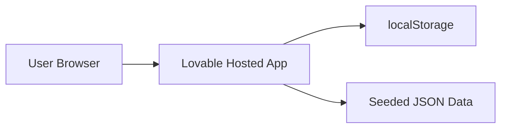

#### Real pilot deployment

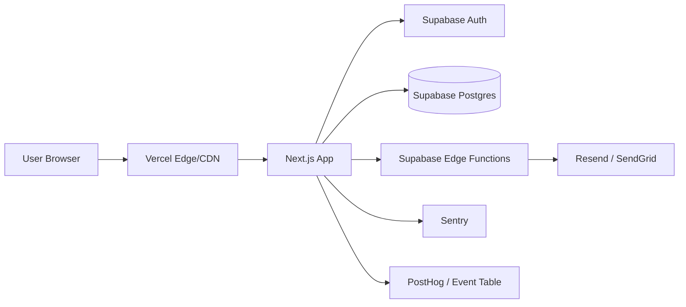

### Networking & security

| Concern | Recommendation |
|---|---|
| HTTPS | Required in all deployed environments |
| CORS | Restrict to approved frontend domains in real pilot |
| Secrets | Environment variables only; never client-expose service role keys |
| Database access | Client uses anon key + RLS; admin/service role only in server functions |
| Admin routes | Require admin role and RLS enforcement |
| Rate limiting | Add API rate limits before public pilot |
| Secure headers | Use standard browser security headers via hosting config |

### Scalability strategy

#### Initial scale assumptions

| User group | Expected initial scale |
|---|---:|
| Founders | 10-100 |
| Candidates | 50-500 |
| Admins | 1-10 |
| Matches | 500-10,000 |
| Invites | 100-2,000 |

This scale does not require distributed architecture.

#### Horizontal vs vertical scaling

- Frontend scales horizontally through Vercel/CDN.
- Supabase Postgres is sufficient vertically for pilot scale.
- Move match generation server-side only when candidate volume or privacy requires it.
- Cache dashboard aggregates only if admin queries become slow.

### CDN & caching layers

| Asset/data | Caching recommendation |
|---|---|
| Static frontend assets | CDN cache via Vercel |
| Seed JSON data | Bundled at build time for MVP |
| Candidate profile queries | No aggressive caching in real pilot due to privacy |
| Admin aggregates | Cache for 1-5 minutes if needed |
| Match results | Store computed matches; do not recompute on every page load |

---

## INTEGRATIONS & THIRD-PARTY SERVICES

### External services

| Service | MVP | Real pilot | Purpose |
|---|---:|---:|---|
| Lovable | Yes | Optional | Rapid app build |
| Supabase | Optional | Yes | Auth, DB, RLS, storage, edge functions |
| Vercel | Optional | Yes | Frontend hosting |
| Resend / SendGrid | No | Yes | Transactional invite emails |
| Sentry | No | Yes | Error monitoring |
| PostHog | No | Optional | Funnel analytics |
| ESSEC SSO/email verification | No | Preferred | Trust and access control |

### Fallback strategy

| Dependency | Failure mode | Fallback |
|---|---|---|
| Supabase unavailable | App cannot load real data | Show maintenance/error state; retry |
| Email provider fails | Invites not sent | Keep invite record; retry later; show pending email status |
| Analytics fails | Events not recorded | Do not block user actions |
| Auth provider fails | Users cannot log in | Show clear login error and status page link |
| Matching function fails | No matches generated | Show error and allow admin/manual matching |

### Rate limiting & retry policies

For real pilot:

1. Limit project creation per user to prevent spam.
2. Limit invites per project until candidate response quality is known.
3. Retry email sending with exponential backoff.
4. Do not retry candidate response mutations blindly; prevent duplicate responses with idempotency keys or unique constraints.
5. Log failed match generation and keep project in “match generation failed” status.

---

## SECURITY

### Authentication flow

#### MVP authentication flow

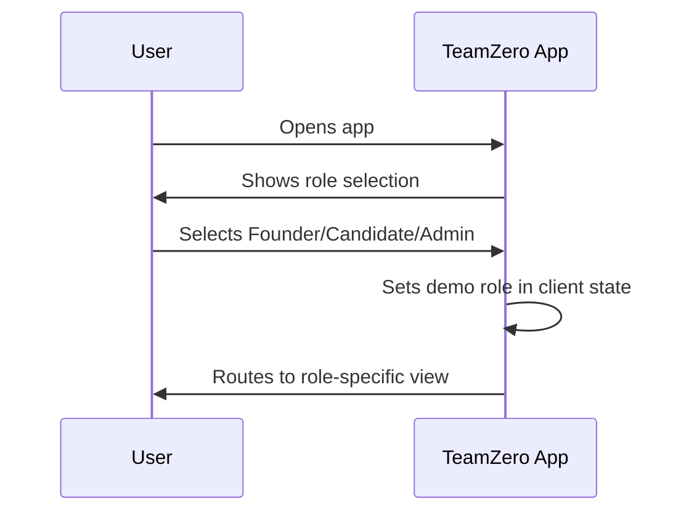

#### Real pilot authentication flow

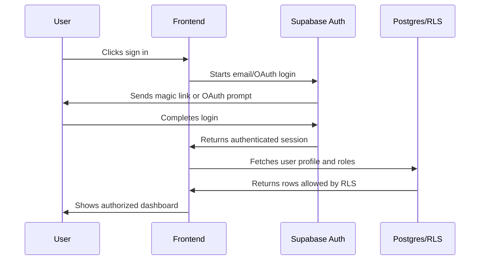

### Authorization model

Use RBAC for first real pilot.

| Role | Permissions |
|---|---|
| Founder | Create/edit own projects, generate matches for own projects, invite candidates, update own match outcomes |
| Candidate | View own profile, view invites addressed to them, respond to own invites |
| Admin | View all projects/candidates/matches/invites, add admin notes, approve/reject records |
| Super admin | Manage admin users and system settings |

ABAC can be added later for cohort/program-specific admin permissions.

### Supabase RLS examples

#### Founder can view own projects

```sql
create policy "founders can view own projects"
on projects
for select
using (founder_id = auth.uid());
```

In practice, if `projects.founder_id` points to `app_users.id`, map auth.uid() to app_users.auth_user_id:

```sql
create policy "founders can view own projects via app user"
on projects
for select
using (
  founder_id in (
    select id from app_users where auth_user_id = auth.uid()
  )
);
```

#### Candidate can view invites addressed to their profile

```sql
create policy "candidates can view own invites"
on invites
for select
using (
  candidate_id in (
    select cp.id
    from candidate_profiles cp
    join app_users u on u.id = cp.user_id
    where u.auth_user_id = auth.uid()
  )
);
```

#### Admin can view all records

```sql
create policy "admins can view all projects"
on projects
for select
using (
  exists (
    select 1
    from app_users u
    join user_roles ur on ur.user_id = u.id
    where u.auth_user_id = auth.uid()
    and ur.role in ('admin', 'super_admin')
  )
);
```

### Data encryption

| Data state | Requirement |
|---|---|
| In transit | HTTPS/TLS only |
| At rest | Supabase/provider-managed encryption |
| Secrets | Hosted environment variables, no hardcoding |
| Email content | Avoid sensitive project details in notification emails |
| Contact details | Reveal only after mutual interest |

### OWASP Top 10 mitigations

| Risk | Mitigation |
|---|---|
| Broken access control | RLS, server-side role checks, route guards |
| Cryptographic failures | TLS, managed encryption, no secrets in frontend |
| Injection | Parameterized queries via Supabase client; input validation |
| Insecure design | Privacy-by-design, explicit trust model, limited data collection |
| Security misconfiguration | Separate dev/staging/prod, restrict CORS, secure headers |
| Vulnerable components | Dependency updates and vulnerability scanning |
| Identification/auth failures | Verified login, secure session handling |
| Software/data integrity failures | Versioned migrations, protected branches |
| Logging/monitoring failures | Sentry/logging for auth, invite, match failures |
| SSRF | Avoid arbitrary server-side URL fetches from user input |

### Compliance

#### GDPR considerations for real pilot

1. Establish lawful basis: consent or legitimate interest depending on ESSEC setup.
2. Provide privacy notice before profile/project submission.
3. Collect only required matching data.
4. Allow profile deletion/visibility changes.
5. Define retention period for inactive projects and candidates.
6. Avoid sensitive personal data fields.
7. Keep audit logs for admin access/action.
8. Do not expose contact details before mutual interest.

---

## OBSERVABILITY

### Logging strategy

#### MVP

- Use console logs only during development.
- Remove noisy logs before demo.
- Add visible error states for failed actions.

#### Real pilot

Log structured events for:

1. Project created.
2. Project updated.
3. Match generation started/completed/failed.
4. Candidate shortlisted.
5. Invite sent.
6. Candidate responded.
7. Outcome updated.
8. Admin note added.
9. Authorization failure.
10. Email sending failure.

Example event shape:

```ts
type ProductEvent = {
  eventName: string;
  userId?: string;
  role?: 'founder' | 'candidate' | 'admin';
  entityType?: 'project' | 'candidate' | 'match' | 'invite';
  entityId?: string;
  properties?: Record<string, unknown>;
  timestamp: string;
};
```

### Metrics & dashboards

#### Product dashboard

| Metric | Purpose |
|---|---|
| Project brief starts/completions | Measure founder intake friction |
| Match generation count | Measure active demand |
| Average matches per project | Detect supply issues |
| Match relevance rating | Detect quality issues |
| Shortlist rate | Measure founder confidence |
| Invite rate | Measure action |
| Candidate positive response rate | Measure candidate interest |
| Serious calls scheduled | Measure north star |
| Trial sprints started | Measure deeper conversion |
| Joined projects | Measure final conversion |

#### Technical dashboard

| Metric | Alert threshold |
|---|---|
| Frontend error rate | > 2% sessions |
| API error rate | > 1% requests |
| Match generation failure | Any repeated failure |
| Email failure rate | > 5% sends |
| DB query latency | p95 > 1s for dashboard |
| Auth failure spike | Sudden increase |

### Distributed tracing

Not required for MVP. For real pilot, tracing is optional because architecture is simple. If using serverless functions for emails/matching, correlate logs using request IDs.

### Alerting rules

| Alert | Severity |
|---|---|
| App unavailable | Critical |
| Auth unavailable | Critical |
| Invite email failure spike | Important |
| Match generation failure | Important |
| Admin dashboard failing | Important |
| Analytics event ingestion failing | Improvement |

---

## MATCHING ENGINE DESIGN

### Matching flow

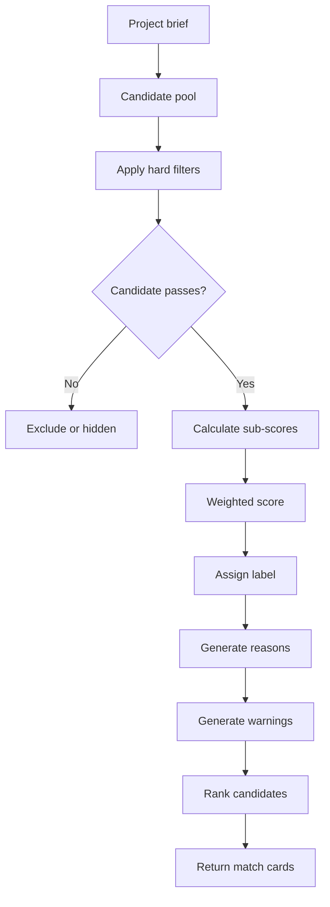

### Scoring weights

| Criterion | Weight |
|---|---:|
| Role fit | 30% |
| Commitment / intent fit | 25% |
| Skill + proof-of-work fit | 20% |
| Industry / problem interest fit | 15% |
| Working style fit | 10% |

### Hard filters

A candidate should not be strongly recommended if:

1. They are not open to the requested collaboration type.
2. Their availability is far below expected commitment.
3. They have no relevant or adjacent skill.
4. Their profile lacks any trust signal.
5. Their candidate intent is unclear.
6. Their visibility status is hidden or archived.

### Example TypeScript matching function

```ts
type MatchResult = {
  candidateId: string;
  matchScore: number;
  label: 'strong' | 'good' | 'exploratory' | 'hidden';
  subScores: {
    roleFit: number;
    commitment: number;
    skill: number;
    industry: number;
    workingStyle: number;
  };
  hardFilterPassed: boolean;
  reasons: string[];
  warnings: string[];
};

export function scoreCandidate(project: Project, candidate: CandidateProfile): MatchResult {
  const hardFilter = evaluateHardFilters(project, candidate);

  if (!hardFilter.passed) {
    return {
      candidateId: candidate.id,
      matchScore: 0,
      label: 'hidden',
      subScores: { roleFit: 0, commitment: 0, skill: 0, industry: 0, workingStyle: 0 },
      hardFilterPassed: false,
      reasons: [],
      warnings: hardFilter.reasons,
    };
  }

  const roleFit = scoreOverlap(project.rolesNeeded, candidate.roleFit);
  const commitment = scoreCommitment(project, candidate);
  const skill = scoreSkillFit(project.skillsNeeded, candidate.topSkills, candidate.proofOfWork);
  const industry = scoreOverlap([project.industry], candidate.startupInterests);
  const workingStyle = scoreOverlap(project.workingStylePreferences ?? [], candidate.workingStyleTags);

  const matchScore = Math.round(
    roleFit * 0.30 +
    commitment * 0.25 +
    skill * 0.20 +
    industry * 0.15 +
    workingStyle * 0.10
  );

  return {
    candidateId: candidate.id,
    matchScore,
    label: labelForScore(matchScore),
    subScores: { roleFit, commitment, skill, industry, workingStyle },
    hardFilterPassed: true,
    reasons: generateReasons(project, candidate, { roleFit, commitment, skill, industry, workingStyle }),
    warnings: generateWarnings(project, candidate),
  };
}

function labelForScore(score: number): MatchResult['label'] {
  if (score >= 85) return 'strong';
  if (score >= 70) return 'good';
  if (score >= 55) return 'exploratory';
  return 'hidden';
}
```

### Unit tests required

At minimum, test:

1. Perfect role + commitment match returns strong.
2. Role mismatch fails or scores low.
3. Low availability prevents strong label.
4. Hidden candidate is excluded.
5. Candidate with no proof-of-work gets warning.
6. Candidate below 55 is hidden by default.
7. Match reasons match sub-score drivers.
8. Ranking is deterministic.

---

## ARCHITECTURE DECISION RECORDS

### ADR-001 - Lovable-first MVP

**Context**  
The product must be built quickly for validation and classroom demonstration.

**Decision made**  
Use Lovable for the MVP UI and app flow. Keep the architecture compatible with React/Supabase migration.

**Alternatives considered**  
- Build manually in Next.js: more control, slower delivery.
- Build in Figma only: faster but does not validate workflow logic.
- Use Airtable/Typeform only: useful for concierge validation but weak product demo.

**Consequences**  
Fast build and demo readiness, but some technical debt if Lovable-generated code is messy. Mitigate by isolating domain logic and matching rules.

**Status**  
Accepted.

### ADR-002 - Rules-based matching before AI matching

**Context**  
The MVP must prove users trust recommendations. AI matching may be impressive but opaque.

**Decision made**  
Use deterministic weighted scoring with hard filters and visible explanations.

**Alternatives considered**  
- LLM-based semantic matching: flexible but opaque and harder to test.
- Manual matching only: strong validation but not a product demo.
- Embedding similarity: useful later but risks matching similarity over complementarity.

**Consequences**  
High explainability and easier debugging. May miss nuanced semantic fit. Can evolve later by adding AI-generated suggestions behind a transparent rules layer.

**Status**  
Accepted.

### ADR-003 - Mock authentication for MVP

**Context**  
Real ESSEC authentication adds complexity and privacy obligations.

**Decision made**  
Use role selection in MVP. Add real auth only for pilot.

**Alternatives considered**  
- Supabase auth from day one: more realistic, slower.
- ESSEC SSO: ideal for production, unrealistic for classroom MVP.

**Consequences**  
MVP is not secure and must use mock data. Clear migration path required for pilot.

**Status**  
Accepted for MVP; not acceptable for real pilot.

### ADR-004 - No in-app chat in MVP

**Context**  
The product outcome is serious conversation creation, not messaging volume.

**Decision made**  
Use simulated invites and candidate responses. Contact or scheduling can remain manual.

**Alternatives considered**  
- Build chat: high complexity and moderation burden.
- Email integration: useful later, not required for validation.

**Consequences**  
Faster scope and clearer validation. Must track conversation outcome manually.

**Status**  
Accepted.

### ADR-005 - Supabase for real pilot backend

**Context**  
The real pilot needs auth, relational data, RLS, and low operational overhead.

**Decision made**  
Use Supabase Postgres/Auth/RLS/Edge Functions.

**Alternatives considered**  
- Firebase: good real-time, weaker relational analytics.
- Custom backend: more control, slower.
- Airtable: fast, insufficient access-control maturity.

**Consequences**  
Good pilot velocity and strong data model. Requires careful RLS design.

**Status**  
Proposed for pilot.

### ADR-006 - Store computed matches

**Context**  
Founders and admins need stable match results and status transitions.

**Decision made**  
Persist generated matches instead of recomputing every page load.

**Alternatives considered**  
- Compute matches live every time: simpler initially but unstable and harder to audit.
- Manual matching only: not scalable.

**Consequences**  
Stable dashboards and status tracking. Must regenerate matches when project or candidate profiles change.

**Status**  
Accepted for real pilot; optional for MVP.

---

## DIAGRAMS

### Global architecture

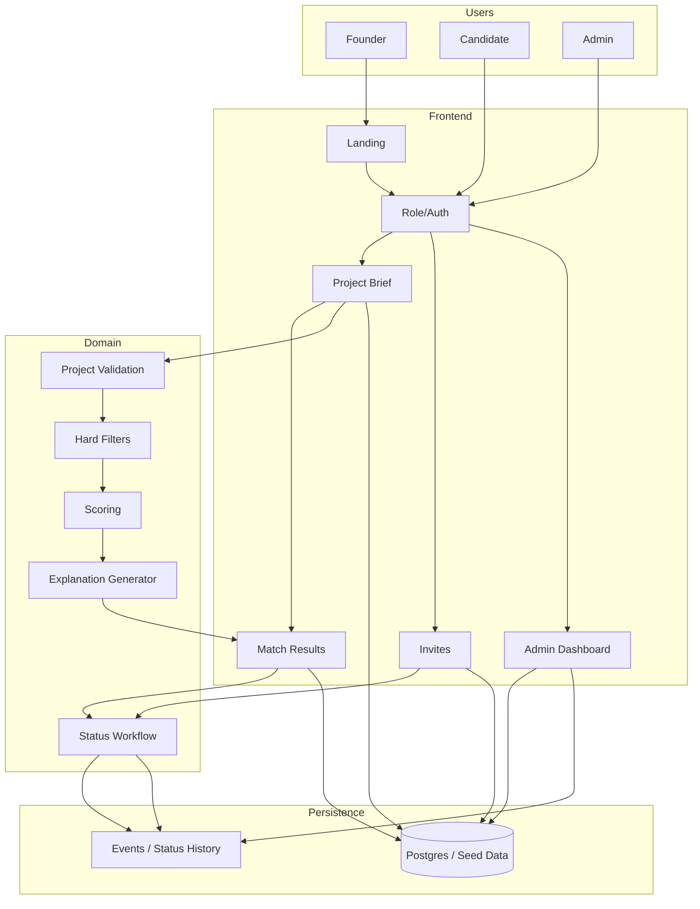

### Sequence diagram: founder creates project and receives matches

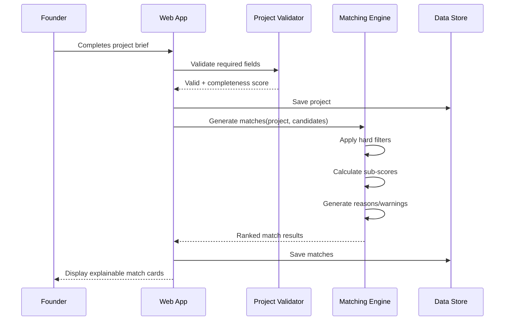

### Sequence diagram: founder invites candidate and candidate responds

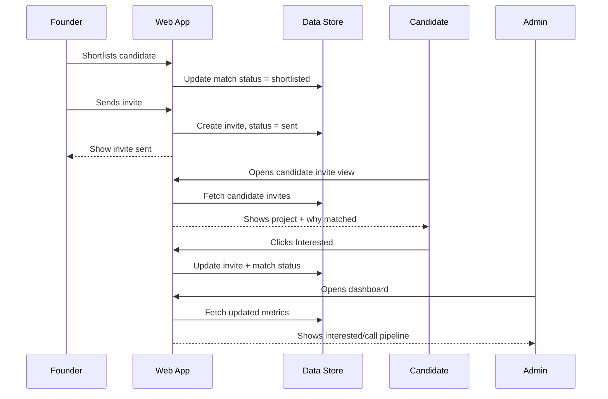

### Entity-relationship diagram

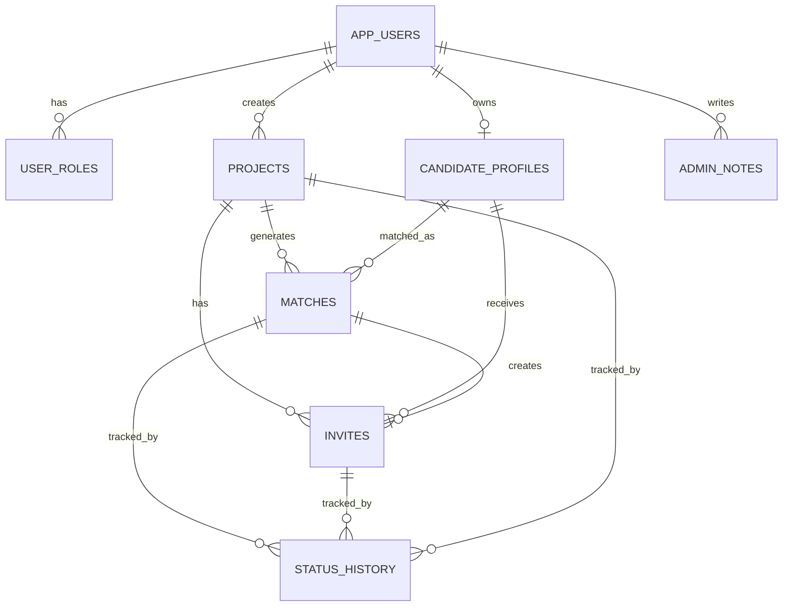

### Deployment diagram: real pilot

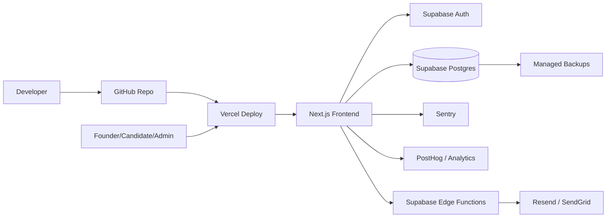

---

## IMPLEMENTATION CHECKLIST

### MVP build checklist

- [ ] Create role selection screen.
- [ ] Create seeded candidate dataset with 12-20 profiles.
- [ ] Create 2-3 seeded founder projects.
- [ ] Build project brief form with validation.
- [ ] Build project preview card.
- [ ] Implement hard filters.
- [ ] Implement weighted scoring.
- [ ] Generate match reasons and warnings.
- [ ] Build ranked match results page.
- [ ] Build shortlist and simulated invite flow.
- [ ] Build candidate invite response page.
- [ ] Build admin dashboard with KPIs and gap analysis.
- [ ] Add empty/loading/error states.
- [ ] Add demo reset.
- [ ] Test full founder -> candidate -> admin loop.

### Real pilot readiness checklist

- [ ] Add Supabase auth.
- [ ] Add database schema and migrations.
- [ ] Add RLS policies.
- [ ] Add candidate profile creation.
- [ ] Add real invite email sending.
- [ ] Add status history.
- [ ] Add analytics events.
- [ ] Add privacy notice and consent.
- [ ] Add profile deletion/visibility controls.
- [ ] Add monitoring and alerting.
- [ ] Add backup/restore process.

---

## OPEN TECHNICAL QUESTIONS

1. Should the MVP use localStorage only, or Supabase from day one for persistence?
2. Will Lovable-generated code be exported to GitHub for maintainability?
3. Is the candidate view tied to a selected seeded profile, or does it show all simulated invites?
4. Should match generation happen immediately on project submission or only after preview confirmation?
5. Should admin approval be simulated in MVP or deferred?
6. Should candidates be able to edit their seeded profile in the demo?
7. What exact ESSEC authentication method is feasible in a real pilot?
8. Who owns GDPR/data-controller responsibilities in a real ESSEC pilot?
9. Should contact details be exchanged inside TeamZero or externally after mutual interest?
10. Should the platform support multiple cohorts/programs in the first real pilot?

